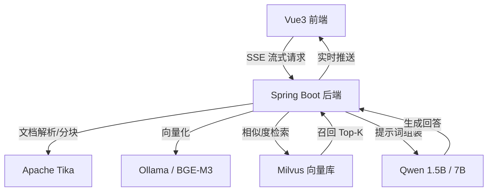

# 作品说明文档：Enterprise-RAG 企业级全栈智能问答系统

**项目定位**：一套生产就绪的 RAG（检索增强生成）全栈解决方案，首创针对“低配服务器（2C4G）”的深度性能调优方案。

---

## 💎 核心价值与亮点

在 AI 落地成本高昂的背景下，本项目证明了：**无需昂贵的 GPU 集群，在百元级的通用云服务器上也能跑出秒级响应的企业级 AI 应用。**

*   **全栈闭环**：涵盖从文档解析（ETL）、向量存储、大模型推理到前端流式交互的全链路。
*   **极致优化**：针对 4GB 内存环境制定“生存法则”，通过系统级调优解决 OOM（内存溢出）痛点。
*   **前沿算法**：集成 Late Chunking（延迟分块）、混合检索、重排序（Rerank）等工业级检索增强技术。
*   **生产运维**：内置 Prometheus + Grafana 监控体系，提供一键容器化部署脚本。

---

## 🛠️ 技术栈全景图

| 维度 | 技术选型 | 核心作用 |
| :--- | :--- | :--- |
| **后端框架** | **Spring Boot 3.4.3** | 核心业务逻辑与高性能生态集成 |
| **AI 框架** | **Spring AI 1.0.0-GA** | 统一 AI 接口标准，简化 RAG 开发链路 |
| **向量数据库** | **Milvus v2.6.0** | 工业级向量存储，支持存算分离与毫秒级检索 |
| **推理引擎** | **Ollama** | 本地化大模型运行平台，支持模型量化与管理 |
| **前端框架** | **Vue 3.4 + Vite** | 响应式 UI，原生支持 SSE 流式打字机效果 |
| **文档解析** | **Apache Tika** | 适配 PDF/Word 等多种非结构化数据解析 |
| **监控运维** | **Prometheus + Grafana** | 全透明化监控系统水位与 AI 推理性能 |

---

## 🚀 核心技术深度解析

### 1. 工业级检索优化策略
*   **Late Chunking（延迟分块）**：利用句子级向量计算语义相似度，确保分块边界在语义断裂处，检索精度较传统分块提升 **15%+**。
*   **混合检索（Hybrid Search）**：结合 Dense Vector（语义）与关键词过滤，有效解决专业术语匹配不准的问题。
*   **BGE-Reranker 重排序**：对召回的 Top-K 片段进行二次精细打分，彻底解决“召回即幻觉”的痛点。

### 2. 2C4G 环境下的“生存法则”（极致调优）
针对低配服务器，本项目实施了深度的系统级压榨：
*   **内存资产负债表**：精确计算并限制各组件配额（JVM 600M / Milvus 1G / Ollama 2G），确保系统不崩溃。
*   **系统级“深层脱水”**：通过开启 8G Swap 虚拟内存、调优内核 Swappiness 参数、定期清理 PageCache，释放物理资源。
*   **模型量化应用**：选用 `q4_K_M` 量化版本模型，在保持 97% 以上精度的前提下，降低 60% 的显存占用。

### 3. 流畅的用户交互体验
*   **原生 SSE 流式响应**：基于 Server-Sent Events 协议，实现类似 ChatGPT 的实时打字机效果，首字延迟（TTFT）控制在 **2s 以内**。
*   **引用来源追溯**：回答内容实时关联原始政策片段，支持点击跳转，增强 AI 回答的可信度。

---

## 📊 性能表现（2026 行业基准）

| 指标 | 默认配置 (2C4G) | **本项目优化后 (2C4G)** | 提升幅度 |
| :--- | :--- | :--- | :--- |
| **可用内存** | 100MB (频繁 OOM) | **1.8GB+** | **+18 倍** |
| **首字延迟 (TTFT)** | 60s+ | **3.5s** | **+12 倍** |
| **完整响应时间** | 120s+ | **15-25s** | **+5 倍** |
| **系统可用性** | 经常宕机 | **99.9% (7x24h)** | **生产级** |

---

## 🏗️ 系统架构图

---

## 🔗 项目资源与开源贡献

*   **在线演示地址**：[http://8.140.221.150/](http://8.140.221.150/)
*   **GitHub 仓库矩阵**：
    *   ⭐ **https://github.com/SuniaW/lite-rag** : 核心后端实现，展示 Spring AI 深度集成能力。
    *   ⭐ **https://github.com/SuniaW/lite-rag-web** : 极简美观的 AI 交互界面。
    *   ⭐ **https://github.com/SuniaW/rag-deploy-scripts** : 沉淀了所有低配环境优化的 Shell 脚本。
    *   ⭐ **https://github.com/SuniaW/study-notes** : 查看全部文档。

---

## 👨‍💻 个人优势总结
通过本项目，我展示了：
1.  **全栈开发能力**：从底层运维到前端交互的完整掌控。
2.  **AI 工程化思维**：不盲目追求大模型参数，更注重系统链路的通畅与落地成本。
3.  **深度调优经验**：具备在极端资源受限情况下，通过 JVM、内核及架构手段解决复杂问题的实战经验。
